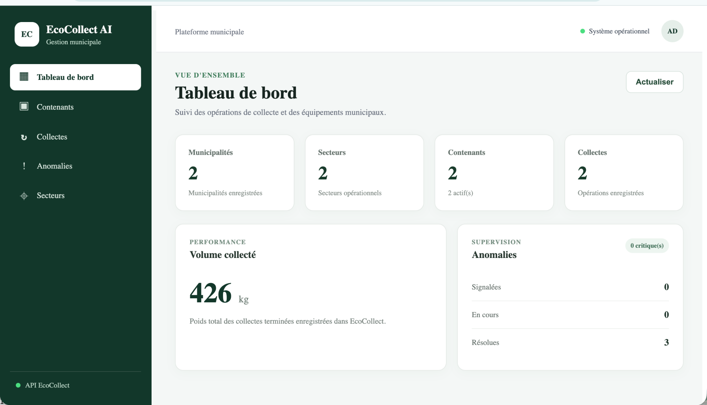
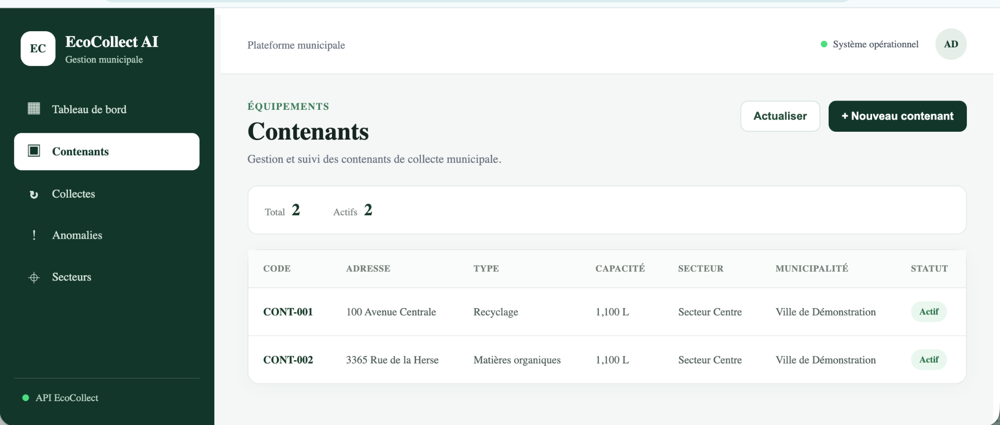
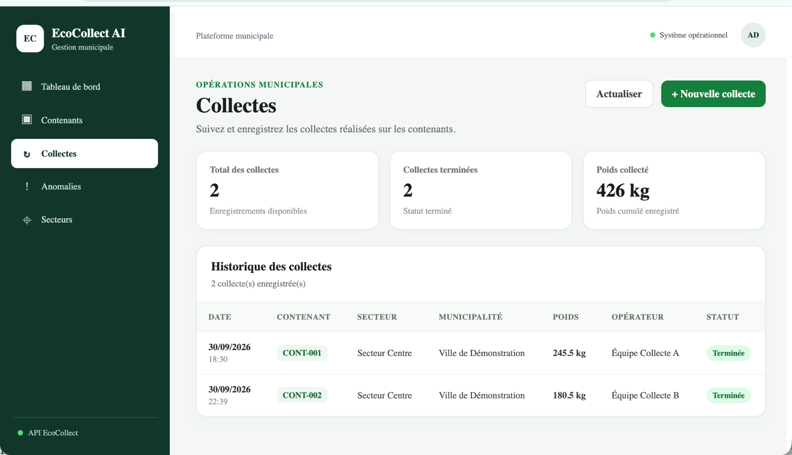
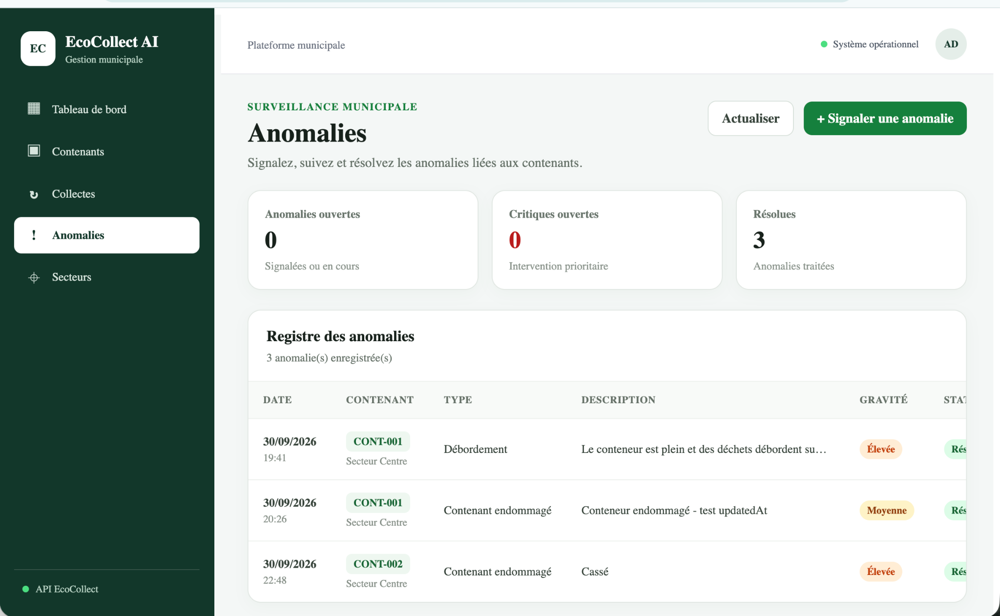
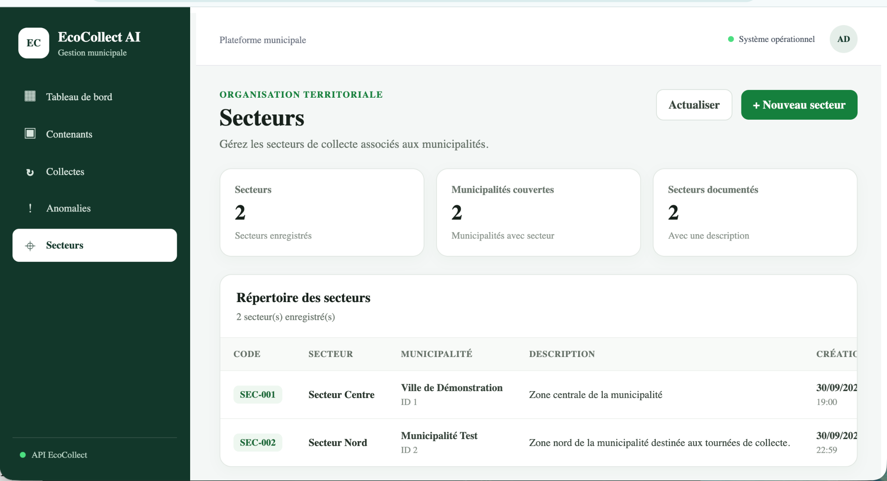

# EcoCollect AI

**EcoCollect AI** est une application web Full Stack de démonstration consacrée au suivi des opérations de collecte municipale.

Le projet centralise les informations relatives aux municipalités, secteurs, contenants, collectes et anomalies et fournit un tableau de bord opérationnel.

Il met en pratique une architecture moderne basée sur **Angular, TypeScript, Java, Spring Boot, PostgreSQL, REST, Docker et GitHub Actions**.

## Fonctionnalités

- Tableau de bord avec statistiques opérationnelles
- Gestion des municipalités et des secteurs
- Gestion des contenants
- Enregistrement des collectes
- Signalement et résolution des anomalies
- Validation des données côté backend
- API REST documentée avec OpenAPI
- Migrations PostgreSQL avec Flyway
- Healthchecks avec Spring Boot Actuator
- Déploiement local avec Docker Compose
- Tests automatisés frontend et backend
- Intégration continue avec GitHub Actions

## Aperçu de l'application

### Tableau de bord

Le tableau de bord fournit une vue synthétique des opérations municipales : contenants actifs, collectes réalisées, poids collecté et suivi des anomalies.

### Gestion opérationnelle

| Contenants | Collectes |
| --- | --- |
|  |  |
| Suivi des contenants, de leur type, capacité, statut et secteur. | Enregistrement et consultation des opérations de collecte. |

| Anomalies | Secteurs |
| --- | --- |
|  |  |
| Signalement, suivi et résolution des anomalies opérationnelles. | Organisation des secteurs par municipalité. |

## Architecture

    Utilisateur
        |
        v
    Angular
        |
        v
    Nginx
        |
        | /api
        v
    Spring Boot REST API
        |
        v
    Spring Data JPA
        |
        v
    PostgreSQL

Nginx sert l'application Angular et agit comme reverse proxy vers l'API Spring Boot.

## Stack technique

### Frontend

- Angular
- TypeScript
- SCSS
- Angular Router
- HttpClient

### Backend

- Java 17
- Spring Boot
- Spring Web MVC
- Spring Data JPA
- Jakarta Validation
- Flyway
- Spring Boot Actuator
- OpenAPI / Swagger

### Base de données

- PostgreSQL 16

### DevOps

- Docker
- Docker Compose
- Nginx
- Git
- GitHub Actions

## Modules fonctionnels

Le frontend est organisé autour des modules suivants :

    dashboard
    containers
    collections
    anomalies
    sectors

## API REST

Les principales ressources exposées sont :

    /api/municipalities
    /api/sectors
    /api/containers
    /api/collections
    /api/anomalies
    /api/dashboard/statistics

Spring Boot Actuator fournit également :

    /actuator/health

La documentation OpenAPI/Swagger est disponible côté backend :

    /swagger-ui/index.html

## Démarrage avec Docker

### Prérequis

- Docker
- Docker Compose
- Git

### Installation

Cloner le dépôt :

    git clone https://github.com/alassanediop2024/ecocollect-ai.git
    cd ecocollect-ai

Créer la configuration locale :

    cp .env.example .env

Définir ensuite un mot de passe PostgreSQL approprié dans le fichier `.env`.

Construire et démarrer l'application :

    docker compose up -d --build

Vérifier les services :

    docker compose ps

L'application web est alors exposée localement sur le port **8082**.

Pour arrêter les services :

    docker compose down

Les données PostgreSQL sont conservées dans un volume Docker persistant.

## Configuration et sécurité

Les secrets ne sont pas intégrés au code source.

Le backend utilise notamment les variables d'environnement :

    DB_URL
    DB_USERNAME
    DB_PASSWORD

Le fichier `.env` local est exclu de Git.

Le dépôt contient uniquement `.env.example` afin de documenter les variables nécessaires sans publier de secrets.

## Tests

### Backend

    cd backend
    ./mvnw clean test

Le projet dispose actuellement de **12 tests backend** couvrant notamment le contexte Spring et plusieurs services métier.

### Frontend

    cd frontend
    npm ci
    npm test -- --watch=false

Le frontend dispose actuellement de **3 tests automatisés**.

### Build de production

    npm run build -- --configuration production

## Intégration continue

Le workflow GitHub Actions se trouve dans :

    .github/workflows/ci.yml

Il est exécuté lors des `push` et `pull_request` sur la branche `main`.

La CI automatise :

    Backend
      -> Java 17
      -> tests Maven

    Frontend
      -> Node.js 20
      -> npm ci
      -> tests Angular
      -> build Angular de production

## Utilisation de l'IA dans le développement

L'intelligence artificielle est utilisée comme **outil d'assistance au développement**, avec validation humaine des propositions avant leur intégration.

### Exemple 1 - Conception et tests

L'IA a notamment été utilisée pour assister :

- l'analyse des besoins ;
- la structuration initiale de certains composants ;
- la proposition de scénarios de tests ;
- l'identification de cas limites ;
- l'analyse d'erreurs pendant l'intégration.

Les propositions sont ensuite relues, adaptées au projet, compilées et testées dans l'environnement réel.

### Exemple 2 - Dockerisation et diagnostic

L'IA a également servi d'assistant lors de la Dockerisation et du diagnostic de problèmes d'intégration.

La validation finale a été effectuée sur la chaîne complète :

    Navigateur
        |
        v
    Nginx
        |
        v
    Spring Boot
        |
        v
    PostgreSQL

Les conteneurs, healthchecks, appels REST et données persistées ont été vérifiés avant validation dans Git.

### Validation humaine

Le processus appliqué est :

    Proposition assistée par IA
              |
              v
        Relecture humaine
              |
              v
      Adaptation au projet
              |
              v
          Compilation
              |
              v
     Tests automatisés
              |
              v
     Tests d'intégration
              |
              v
        Validation Git

L'IA est utilisée pour améliorer la productivité, l'analyse technique et la documentation, tout en conservant une responsabilité humaine sur les décisions d'architecture et la qualité du logiciel.

## Évolutions envisagées

Les évolutions prévues comprennent notamment :

- analyse intelligente des données de collecte ;
- génération de synthèses opérationnelles ;
- détection et priorisation d'anomalies ;
- cartographie des contenants ;
- graphiques et indicateurs avancés ;
- authentification et gestion des rôles ;
- augmentation de la couverture de tests ;
- déploiement cloud automatisé ;
- observabilité et supervision.

Ces éléments sont des **perspectives d'évolution** et ne sont pas présentés comme des fonctionnalités déjà disponibles.

## Qualité logicielle

Le projet applique notamment :

- séparation frontend/backend ;
- architecture REST ;
- validation des entrées ;
- gestion centralisée des erreurs ;
- migrations Flyway ;
- tests automatisés ;
- configuration par variables d'environnement ;
- conteneurisation ;
- healthchecks ;
- intégration continue ;
- commits Git progressifs ;
- validation humaine du code assisté par IA.

## Auteur

**Alassane Diop**

Projet Full Stack réalisé dans le cadre d'un portfolio professionnel.

## Licence

Projet de démonstration et de portfolio.
